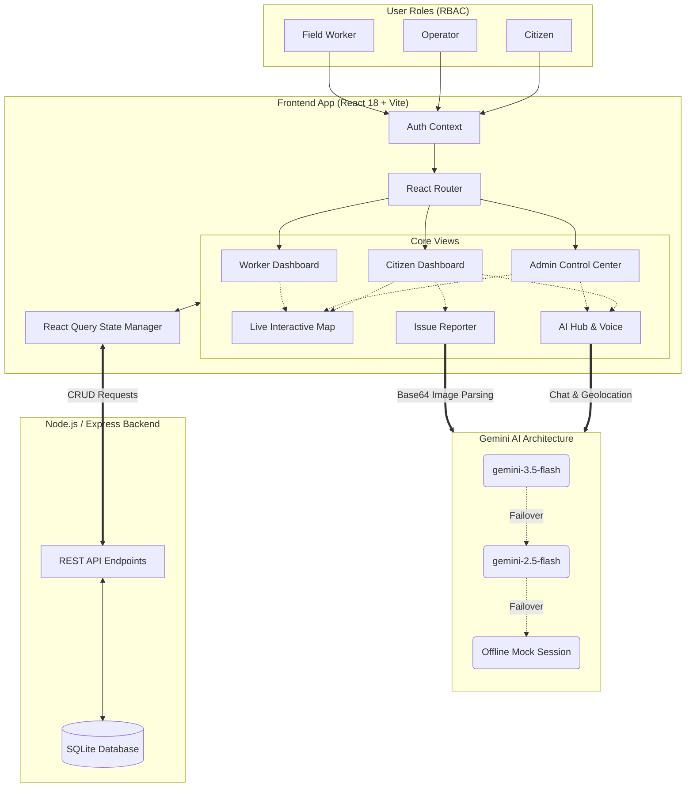

# CivicLens AI Operating System - Project Documentation

## Overview

CivicLens is a Next-Generation AI-Powered City Management Operating System. It unifies citizens, municipal operators, and field workers into a single, cohesive interface. The system leverages AI (like Gemini Vision and Conversational AI) to categorize civic issues, predict optimal routes for workers, and analyze city data in real-time.

## Architecture

This project is a **Pure Frontend Application** built with React, TypeScript, Vite, and TailwindCSS. 

To ensure seamless demonstration and testing without complex setups, the backend is a lightweight Node.js/Express server paired with a local SQLite database.

### System Flowchart



### Technology Stack
- **Frontend Framework:** React 18 with Vite
- **Language:** TypeScript
- **Styling:** Tailwind CSS (with custom CSS variables in `index.css`)
- **State & Data Fetching:** `@tanstack/react-query`
- **Animations:** `framer-motion`
- **Routing:** `react-router-dom`
- **Backend API:** Node.js, Express, `better-sqlite3`

## Express Database Service

Located in `server.js`, this service acts as the RESTful backend API.
- **Latency Simulation:** All queries have an artificial 300ms delay to simulate network roundtrips, ensuring loading spinners and skeleton screens render realistically.
- **Data Persistence:** The database state is saved to a local `civiclens.db` SQLite file.
- **Models:** Includes pre-seeded tables for `users`, `departments`, `workers`, `complaints` (issues), and `emergencies`.

## Role-Based Access Control (RBAC)

The application enforces a strict 3-tier role architecture via `AuthContext.tsx`. Users must select a profile on the Login screen, which determines their routing and sidebar navigation options.

### 1. Citizen Role (`CITIZEN`)
Designed for public engagement and transparency.
- **Features:** 
  - File reports using the 3-Step Wizard or Anonymous Portal
  - Run AI Image Analysis on civic damage
  - Track issue resolution timelines
  - Earn and redeem Civic Reward Points
- **Default Route:** `/dashboard`

### 2. Operator Role (`OPERATOR`)
Designed for city administrators and dispatchers operating from a control center.
- **Features:** 
  - Global overview of all active incidents and field workers
  - Analytics dashboards and emergency SOS monitoring
  - Interactive map view of the city
- **Default Route:** `/admin`

### 3. Worker Role (`WORKER`)
Designed for field technicians and repair crews using vehicle-mounted tablets.
- **Features:** 
  - Landscape-optimized grid dashboard
  - Real-time task queue with priority tagging
  - Status management (Pending → In Progress → Resolved)
  - Route optimization preview
- **Default Route:** `/worker`

### Universal Profile System
The `/profile` view dynamically adapts to the logged-in user's role. While it provides detailed civic metrics (like CO2 Saved and Issues Resolved) for Citizens, it automatically simplifies into a clean, professional profile view for Operators and Workers, hiding unnecessary citizen-specific modules.

## UI/UX & Theming System

CivicLens utilizes a highly dynamic, "glassmorphism" aesthetic suitable for modern SaaS dashboards.
- **Theming:** Full Light/Dark mode support via `ThemeContext.tsx`. 
- **Accessibility:** WCAG AA compliant. Includes a dedicated `SettingsContext.tsx` supporting High Contrast mode, Large Text, and Reduced Motion.
- **Color System:** Managed via CSS custom properties in `index.css`, mapped to Tailwind tokens in `tailwind.config.js`.
- **Branding & Assets:** Fully customized with project-specific logos (`logo.jpeg`) and favicons (`icon.ico`) embedded across the Landing Page, Auth Flows, and Sidebar.

## Setup & Running

Starting the project is incredibly simple:

1. Install dependencies:
   ```bash
   npm install
   ```
2. Start the development server (runs both frontend and backend):
   ```bash
   npm run dev
   ```
3. Access the application at `http://localhost:5173`. You will be directed to the Landing Page. Click "Access Platform" to enter the Role Selector.

## AI Integration (Gemini)

CivicLens integrates deeply with Google's Gemini API, employing advanced fallbacks and system prompt engineering to provide robust, context-aware assistance:

### 1. Robust Fallback Architecture (`FallbackChatSession`)
To guarantee 100% uptime regardless of API quota limits or network conditions, the system implements a strict cascading fallback wrapper around the Gemini Generative AI SDK:
- **Primary Node**: Attempts connection to `gemini-3.5-flash`.
- **Secondary Node**: Automatically fails over to `gemini-2.5-flash` if 3.5 is unavailable or throws a 404.
- **Offline Node**: Degrades gracefully to a local `MockChatSession` instance if all API endpoints fail or no API key is provided, ensuring demo functionality is never interrupted.
- **UI State Indicators**: The AI Hub actively polls this fallback state, displaying a dynamic color-coded dot and badge in the top right corner (Blue = 3.5, Purple = 2.5, Red = Offline) to keep users informed of the current model backend.

### 2. Hyper-Local Context (Geolocation)
When launching the AI Hub, the system asynchronously queries the browser's `navigator.geolocation` API. 
If granted, the precise latitude and longitude coordinates are silently appended to the backend system prompt. This allows the AI Assistant to intelligently answer spatial queries like "what's my location?" or contextually infer the ward/district of reported issues (defaulting to Mumbai region for demonstration).

### 3. Image Diagnostics (`ReportIssue.tsx`)
The previous `ImageAnalyzer.tsx` standalone tool was streamlined directly into the **Report Issue** tab. Uploaded imagery of municipal damage (potholes, graffiti) is passed as a base64 encoded payload to the Gemini Vision multimodal endpoint. The prompt explicitly enforces a strict JSON schema return, which is then parsed to auto-fill the complaint form (Summary, Category, Severity, Estimated Resolution). This also utilizes the `3.5 -> 2.5 -> Mock` fallback chain.

### 4. Voice Interaction (Web Speech API)
The AI Hub features a hands-free dictation mode powered by the native browser `webkitSpeechRecognition` engine. 
- **Stable React Hook**: The underlying `useSpeechRecognition` hook is meticulously engineered utilizing `useRef` for all event callbacks to prevent React infinite re-render loops from destroying and recreating the recognition instance mid-speech.
- **Auto-Submission**: Upon detecting a final transcript utterance, the system automatically dispatches a synthetic form submission event, creating a seamless conversational flow.

## Cultural Localization

To better resonate with its target demographic during civic demonstrations, CivicLens implements culturally relevant personas and mock data out-of-the-box:
- **Citizen Persona / Global Mock User**: "Priya Sharma" (formerly Jane Citizen / Arjun Singh)
- **Control Center Operator**: "Ananya Gupta"
- **Field Worker**: "Rahul Verma" (formerly Mike Ross)
High-quality, persona-accurate avatars from Unsplash and UI-Avatars have been mapped to these profiles, enhancing the relatability and visual immersion of the Operating System.
